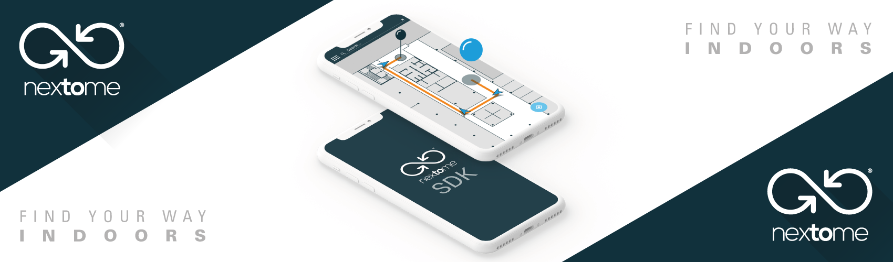

# Nextome SDK Whitelabel app



Official integration docs are available [here](https://docs.nextome.dev/).

## Set up your environment
To use Nextome SDK with your licence:
 1. Provide your Artifactory credentials in `settings.gradle.kts` to download the SDK:
```groovy
    maven {
        url = uri("https://nextome.jfrog.io/artifactory/nextome-libs-prod/")
        credentials {
            username = "your_username"
            password = "your_password"
        }
    }
```

 2. Add your SDK `clientId` and `clientSecret` in `NextomeCredentials.kt`:
```kotlin
object NextomeCredentials {
    const val clientId = "client_id"
    const val clientSecret = "client_secret"
}
```

A working example of this project is available on [Google Play here](https://play.google.com/store/apps/details?id=com.nextome.test). 
